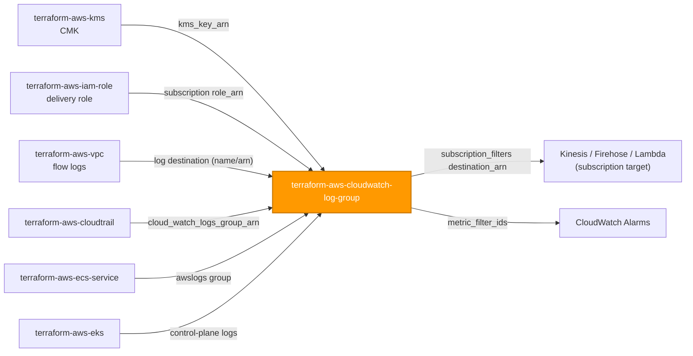
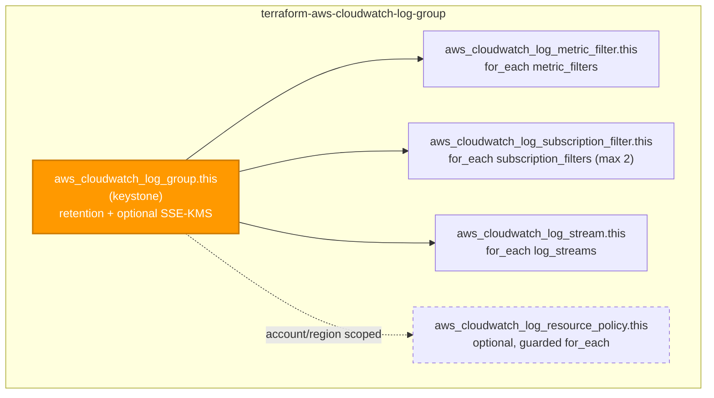

# 🟧 AWS **CloudWatch Log Group** Terraform Module

> **Provisions a secure-by-default Amazon CloudWatch Logs log group together with its metric filters, subscription filters, explicit log streams, and an optional resource policy — one encrypted, retention-bounded logging target from a single module call.** Built for the AWS provider **v6.x**.

[](https://www.terraform.io)
[](https://registry.terraform.io/providers/hashicorp/aws/latest)
[](#)
[](#)
[](#)

---

## 🧩 Overview

- 📦 **One log group, fully wired.** Creates `aws_cloudwatch_log_group` plus everything that lives on it: metric filters, subscription filters, explicit log streams, and an optional resource-based policy.
- ⏳ **Retention is never unbounded.** `retention_in_days` defaults to **365** — log data cannot accumulate forever by accident, in line with the (regulated data-privacy) baseline.
- 🔐 **Encrypted at rest, always.** Log data is encrypted with the AWS-owned CloudWatch Logs key by default; supply `kms_key_arn` to upgrade to a customer-managed CMK for full key control.
- 📈 **Metrics from logs.** Define `metric_filters` to emit CloudWatch metrics (counts, field values, dimensions) from matched events — ready to alarm on.
- 🔁 **Stream out to analytics.** Up to two `subscription_filters` fan matched events to Kinesis, Firehose, or Lambda for real-time processing.
- 🏷️ **Tags where they're allowed.** `var.tags` flows to the log group (the only taggable resource here) and merges with provider `default_tags`; the merged set is surfaced as `tags_all`.
- 🌐 **Region-inherited.** No `region` variable — the caller's provider sets it. Not a us-east-1 global service.

> 💡 **Why it matters:** CloudWatch Logs is the landing zone for VPC flow logs, Lambda, ECS/EKS, and CloudTrail. A single secure-by-default log-group module keeps every logging target encrypted and retention-bounded, so a misconfigured group never becomes an unbounded, unencrypted store of PII.

---

## ❤️ Support this project

If these Terraform modules have been helpful to you or your organization, I'd appreciate your support in any of the following ways:

- ⭐ **Star this repository** to help others discover this Terraform module.
- 🤝 **Connect with me on LinkedIn:** [linkedin.com/in/microsoftexpert](https://www.linkedin.com/in/microsoftexpert)
- ☕ **Buy me a coffee:** [buymeacoffee.com/microsoftexpert](https://buymeacoffee.com/microsoftexpert)

Whether it's a star, a professional connection, or a coffee, every gesture helps keep these modules actively maintained and continually improving. Thank you for being part of the community!

---

## 🗺️ Where this fits in the family

`terraform-aws-cloudwatch-log-group` is a **foundation observability module** — it consumes little, and it is consumed *by* many other modules that hand it their `arn`/`name` as a log destination.



---

## 🧬 What this module builds



| Resource | Count | Created when |
|---|---|---|
| `aws_cloudwatch_log_group.this` | 1 | always (keystone) |
| `aws_cloudwatch_log_metric_filter.this` | 0..N | one per `metric_filters` entry |
| `aws_cloudwatch_log_subscription_filter.this` | 0..2 | one per `subscription_filters` entry (AWS caps at 2) |
| `aws_cloudwatch_log_stream.this` | 0..N | one per `log_streams` entry |
| `aws_cloudwatch_log_resource_policy.this` | 0 or 1 | `resource_policy != null` |

---

## ✅ Provider / Versions

| Requirement | Version |
|---|---|
| Terraform | `>= 1.12.0` |
| `hashicorp/aws` | `>= 6.0, < 7.0` |

The module declares only a `required_providers` block (`providers.tf`) and inherits the configured provider. There is **no `provider {}` block** and **no credential variable** — credentials resolve through the standard AWS chain at the root/pipeline level (env vars → SSO/shared credentials → `assume_role` → instance profile / IRSA → OIDC web identity).

---

## 🔑 Required IAM Permissions

Least-privilege actions the **Terraform execution identity** needs to manage this module.

| Action | Required for | Notes |
|---|---|---|
| `logs:CreateLogGroup`, `logs:DeleteLogGroup` | Log group lifecycle | Core CRUD on the keystone |
| `logs:PutRetentionPolicy`, `logs:DeleteRetentionPolicy` | Retention enforcement | Applied on `retention_in_days` (delete when set to never-expire) |
| `logs:AssociateKmsKey`, `logs:DisassociateKmsKey` | SSE-KMS association | Only when `kms_key_arn` is set / cleared |
| `logs:DescribeLogGroups`, `logs:ListTagsForResource` | Read / refresh | Plan + state refresh |
| `logs:TagResource`, `logs:UntagResource` | Tagging | Log group is the only taggable resource |
| `logs:PutMetricFilter`, `logs:DeleteMetricFilter`, `logs:DescribeMetricFilters` | Metric filters | Only with `metric_filters` |
| `logs:PutSubscriptionFilter`, `logs:DeleteSubscriptionFilter`, `logs:DescribeSubscriptionFilters` | Subscription filters | Only with `subscription_filters` |
| `logs:CreateLogStream`, `logs:DeleteLogStream`, `logs:DescribeLogStreams` | Explicit log streams | Only with `log_streams` |
| `logs:PutResourcePolicy`, `logs:DeleteResourcePolicy`, `logs:DescribeResourcePolicies` | Resource-based policy | Only when `resource_policy` is supplied |
| `kms:DescribeKey` (on `kms_key_arn`) | Validate the CMK at association | Scope to the CMK ARN |
| `iam:PassRole` (on a subscription filter `role_arn`) | Pass the delivery role to a Kinesis/Firehose subscription | Scope to the delivery role ARN; not needed for Lambda targets |

> 🔒 Scope `logs:*` actions to the log-group ARN pattern (e.g. `arn:aws:logs:<region>:<account>:log-group:/casey/*`). Note the resource policy is **account/Region-scoped**, not bound to one group, so `logs:PutResourcePolicy` cannot be narrowed to a single group ARN.

> ℹ️ **Service-linked role.** CloudWatch Logs needs none of its own. A Lambda subscription target instead requires a `lambda:AddPermission` grant allowing `logs.amazonaws.com` to invoke — that lives on the function, not in this module.

---

## 📋 AWS Prerequisites

- **No service-linked role** is required for CloudWatch Logs itself.
- **KMS key policy (when `kms_key_arn` is set).** The CMK's key policy **must** allow the CloudWatch Logs service principal `logs.<region>.amazonaws.com` to `kms:Encrypt*` / `kms:Decrypt*` / `kms:GenerateDataKey*` / `kms:Describe*`, ideally scoped with a `kms:EncryptionContext:aws:logs:arn` condition pinned to this group's ARN. Without it, log delivery fails. (`terraform-aws-kms` can author this grant.)
- **Subscription-filter destination (optional).** The Kinesis stream / Firehose delivery stream / Lambda function must already exist. Cross-account destinations need a destination policy; a Lambda target needs a resource-based permission allowing `logs.amazonaws.com` to invoke it.
- **Region.** Provider-inherited; there is **no `region` variable**. CloudWatch Logs is **not** a us-east-1 global service — create the group in whichever Region its producers live.
- **Quotas** (per [CloudWatch Logs quotas](https://docs.aws.amazon.com/AmazonCloudWatch/latest/logs/cloudwatch_limits_cwl.html)):
 - **2 subscription filters** per log group (hard limit — a third fails at apply with `LimitExceededException`; enforced by an input validation).
 - **Metric filters** are limited per log group (default 100); metric filters and subscription filters are **not supported** on `INFREQUENT_ACCESS` groups.
 - `retention_in_days` must be one of the discrete allowed values (`1…3653`) or `0` (never expire).
 - `DELIVERY`-class groups force retention to **2 days**.

---

## 📁 Module Structure

```
terraform-aws-cloudwatch-log-group/
├── providers.tf # required_providers (aws >= 6.0, < 7.0); no provider block
├── variables.tf # name → retention/kms/class → child collections → resource_policy → tags
├── main.tf # aws_cloudwatch_log_group.this + metric/subscription filters, streams, policy
├── outputs.tf # id + arn + arn_with_suffix + name + child-collection maps + tags_all
├── README.md # this file
└── SCOPE.md # in/out-of-scope, IAM permissions, prerequisites, gotchas
```

---

## ⚙️ Quick Start

Smallest working call — a one-year, encrypted-by-the-AWS-key log group:

```hcl
module "app_logs" {
  source = "git::https://github.com/microsoftexpert/terraform-aws-cloudwatch-log-group?ref=v1.0.0"

  name              = "/casey/app/api"
  retention_in_days = 365 # secure default — shown here for clarity

  tags = {
    Environment = "prod"
    CostCenter  = "1234"
  }
}
```

---

## 🔌 Cross-Module Contract

### Consumes

| Input | Type | Source module |
|---|---|---|
| `kms_key_arn` | `string` (KMS key ARN) | `terraform-aws-kms` |
| `subscription_filters[*].destination_arn` | `string` (Kinesis / Firehose / Lambda ARN) | app-integration / analytics modules |
| `subscription_filters[*].role_arn` | `string` (IAM role ARN) | `terraform-aws-iam-role` |

> Foundation logging target — it needs no sibling output to stand up a group; it is consumed *by* `terraform-aws-vpc` flow logs, Lambda, ECS/EKS, and `terraform-aws-cloudtrail`, which pass this group's `arn`/`name` as their log destination.

### Emits

| Output | Description | Consumed by |
|---|---|---|
| `id` | Log group id (the group name) | metric / subscription filters |
| `arn` | Log group ARN, **without** the `:*` suffix (`arn:aws:logs:<region>:<account>:log-group:<name>`) — the cross-resource reference type | IAM policy resources, services that reject the suffix |
| `arn_with_suffix` | Log group ARN **with** the trailing `:*` (`…:log-group:<name>:*`) | CloudTrail `cloud_watch_logs_group_arn`, all-streams IAM scopes |
| `name` | Log group name | VPC flow logs, Lambda, ECS/EKS, CloudTrail log-destination wiring |
| `kms_key_id` | CMK ARN encrypting the group, or `null` for the AWS-owned key | audit |
| `retention_in_days` | Effective retention (0 = never expire) | governance |
| `log_group_class` | `STANDARD` / `INFREQUENT_ACCESS` / `DELIVERY` | governance |
| `metric_filter_ids` | Map of metric-filter name → id | CloudWatch alarms |
| `subscription_filter_names` | Set of subscription-filter names | inspection |
| `log_stream_arns` | Map of log-stream name → ARN | producers expecting a named stream |
| `resource_policy_id` | Resource-policy id when created; else `null` | inspection |
| `tags_all` | All tags incl. provider `default_tags` (resource tags win) | governance / audit |

---

## 📚 Example Library

<details>
<summary><strong>1 · Minimal — secure defaults (1-year retention, AWS-owned key)</strong></summary>

```hcl
module "logs" {
  source = "git::https://github.com/microsoftexpert/terraform-aws-cloudwatch-log-group?ref=v1.0.0"

  name = "/casey/app/worker"
  # retention_in_days defaults to 365; encrypted at rest by the AWS-owned key
}
```
</details>

<details>
<summary><strong>2 · Shorter retention (explicit, bounded)</strong></summary>

```hcl
module "ephemeral_logs" {
  source = "git::https://github.com/microsoftexpert/terraform-aws-cloudwatch-log-group?ref=v1.0.0"

  name              = "/casey/dev/sandbox"
  retention_in_days = 30 # one of the allowed discrete values
}
```
</details>

<details>
<summary><strong>3 · Customer-managed KMS CMK wired from <code>terraform-aws-kms</code></strong></summary>

```hcl
module "logs_kms" {
  source = "git::https://github.com/microsoftexpert/terraform-aws-kms?ref=v1.0.0"
  alias  = "casey/cloudwatch-logs"
  # key policy must allow logs.<region>.amazonaws.com to Encrypt/Decrypt/GenerateDataKey/Describe,
  # scoped with kms:EncryptionContext:aws:logs:arn to this group's ARN.
}

module "logs" {
  source = "git::https://github.com/microsoftexpert/terraform-aws-cloudwatch-log-group?ref=v1.0.0"

  name        = "/casey/app/secure"
  kms_key_arn = module.logs_kms.arn # upgrade from AWS-owned key to a CMK
}
```
</details>

<details>
<summary><strong>4 · Tags (merge with provider <code>default_tags</code>)</strong></summary>

```hcl
# Caller's provider block owns default_tags; the module never sets it.
provider "aws" {
  default_tags { tags = { Owner = "platform", ManagedBy = "terraform" } }
}

module "tagged_logs" {
  source = "git::https://github.com/microsoftexpert/terraform-aws-cloudwatch-log-group?ref=v1.0.0"

  name = "/casey/app/billing"

  tags = {
    Environment = "prod" # resource tag — wins over default_tags on key conflict
    DataClass   = "PII"
  }
}

# module.tagged_logs.tags_all == { Owner, ManagedBy, Environment, DataClass }
```
</details>

<details>
<summary><strong>5 · Metric filter → CloudWatch metric (count errors)</strong></summary>

```hcl
module "logs" {
  source = "git::https://github.com/microsoftexpert/terraform-aws-cloudwatch-log-group?ref=v1.0.0"

  name = "/casey/app/api"

  metric_filters = {
    errors = {
      filter_pattern = "ERROR"
      metric_transformation = {
        name      = "ErrorCount"
        namespace = "App"
        value     = "1"
      }
    }
  }
}
# Wire module.logs.metric_filter_ids into a CloudWatch alarm.
```
</details>

<details>
<summary><strong>6 · Metric filter with dimensions and default value</strong></summary>

```hcl
module "logs" {
  source = "git::https://github.com/microsoftexpert/terraform-aws-cloudwatch-log-group?ref=v1.0.0"

  name = "/casey/app/latency"

  metric_filters = {
    request-latency = {
      filter_pattern = "[ip, id, user, timestamp, request, status, bytes, latency]"
      metric_transformation = {
        name       = "RequestLatency"
        namespace  = "App"
        value      = "$latency"
        unit       = "Milliseconds"
        dimensions = { Status = "$status" } # conflicts with default_value — pick one
      }
    }
  }
}
```
</details>

<details>
<summary><strong>7 · Subscription filter → Firehose, with a delivery role from <code>terraform-aws-iam-role</code></strong></summary>

```hcl
module "logs_delivery_role" {
  source = "git::https://github.com/microsoftexpert/terraform-aws-iam-role?ref=v1.0.0"
  name   = "casey-logs-to-firehose"

  assume_role_policy = jsonencode({
    Version = "2012-10-17"
    Statement = [{
      Effect    = "Allow"
      Principal = { Service = "logs.amazonaws.com" }
      Action    = "sts:AssumeRole"
    }]
  })
  # inline policy granting firehose:PutRecord* on the destination stream
}

module "logs" {
  source = "git::https://github.com/microsoftexpert/terraform-aws-cloudwatch-log-group?ref=v1.0.0"

  name = "/casey/app/audit"

  subscription_filters = {
    to-firehose = {
      destination_arn = module.audit_firehose.arn
      filter_pattern  = "" # all events
      role_arn        = module.logs_delivery_role.arn
    }
  }
}
```
</details>

<details>
<summary><strong>8 · Subscription filter → Lambda (no role_arn; uses lambda:AddPermission)</strong></summary>

```hcl
module "logs" {
  source = "git::https://github.com/microsoftexpert/terraform-aws-cloudwatch-log-group?ref=v1.0.0"

  name = "/casey/app/events"

  subscription_filters = {
    to-lambda = {
      destination_arn = module.log_processor.arn # Lambda function ARN
      filter_pattern  = "?ERROR ?WARN"
      # role_arn omitted for Lambda — grant logs.amazonaws.com invoke on the function instead
    }
  }
}
```
</details>

<details>
<summary><strong>9 · Two subscription filters (the AWS maximum)</strong></summary>

```hcl
module "logs" {
  source = "git::https://github.com/microsoftexpert/terraform-aws-cloudwatch-log-group?ref=v1.0.0"

  name = "/casey/app/firehose-and-kinesis"

  subscription_filters = {
    to-firehose = {
      destination_arn = module.firehose.arn
      filter_pattern  = ""
      role_arn        = module.delivery_role.arn
    }
    to-kinesis = {
      destination_arn = module.kinesis.arn
      filter_pattern  = "ERROR"
      role_arn        = module.delivery_role.arn
      distribution    = "Random" # spread across shards (Kinesis only)
    }
  }
  # A third subscription filter would fail at apply with LimitExceededException.
}
```
</details>

<details>
<summary><strong>10 · Explicit log streams</strong></summary>

```hcl
module "logs" {
  source = "git::https://github.com/microsoftexpert/terraform-aws-cloudwatch-log-group?ref=v1.0.0"

  name        = "/casey/app/batch"
  log_streams = ["partition-0", "partition-1"] # pre-create streams a consumer expects
}
```
</details>

<details>
<summary><strong>11 · Resource-based policy (Route 53 query logging delivery)</strong></summary>

```hcl
module "logs" {
  source = "git::https://github.com/microsoftexpert/terraform-aws-cloudwatch-log-group?ref=v1.0.0"

  name = "/aws/route53/casey-zone"

  resource_policy = {
    policy_name = "casey-route53-query-logging"
    policy_document = jsonencode({
      Version = "2012-10-17"
      Statement = [{
        Effect    = "Allow"
        Principal = { Service = "route53.amazonaws.com" }
        Action    = ["logs:CreateLogStream", "logs:PutLogEvents"]
        Resource  = "arn:aws:logs:*:*:log-group:/aws/route53/*"
      }]
    })
  }
}
# NOTE: a resource policy is account/Region-scoped, not bound to this group — scope its Resource carefully.
```
</details>

<details>
<summary><strong>12 · Infrequent-access class (cheaper, reduced features)</strong></summary>

```hcl
module "archive_logs" {
  source = "git::https://github.com/microsoftexpert/terraform-aws-cloudwatch-log-group?ref=v1.0.0"

  name            = "/casey/app/rarely-queried"
  log_group_class = "INFREQUENT_ACCESS" # FORCE-NEW; no metric/subscription filters, no Live Tail
  # metric_filters / subscription_filters are NOT supported on this class
}
```
</details>

<details>
<summary><strong>13 · <code>name_prefix</code> + <code>skip_destroy</code> for generated, retention-outliving groups</strong></summary>

```hcl
module "ephemeral_logs" {
  source = "git::https://github.com/microsoftexpert/terraform-aws-cloudwatch-log-group?ref=v1.0.0"

  name_prefix  = "/casey/job/" # avoids plan collisions on a hard-coded name
  skip_destroy = true          # on destroy, remove from state WITHOUT deleting logs in AWS
}
```
</details>

<details>
<summary><strong>14 · VPC flow logs target wired into <code>terraform-aws-vpc</code></strong></summary>

```hcl
module "flow_log_group" {
  source = "git::https://github.com/microsoftexpert/terraform-aws-cloudwatch-log-group?ref=v1.0.0"

  name        = "/casey/vpc/flow-logs"
  kms_key_arn = module.logs_kms.arn
}

module "vpc" {
  source = "git::https://github.com/microsoftexpert/terraform-aws-vpc?ref=v1.0.0"

  name                      = "casey-core"
  cidr_block                = "10.0.0.0/16"
  flow_log_destination_type = "cloud-watch-logs"
  flow_log_log_group_name   = module.flow_log_group.name
  # flow_log_iam_role_arn from a terraform-aws-iam-role granting logs:PutLogEvents
}
```
</details>

<details>
<summary><strong>15 · CloudTrail target — note the <code>arn_with_suffix</code> output</strong></summary>

```hcl
module "trail_logs" {
  source = "git::https://github.com/microsoftexpert/terraform-aws-cloudwatch-log-group?ref=v1.0.0"

  name        = "/aws/cloudtrail/casey-org"
  kms_key_arn = module.logs_kms.arn
}

module "cloudtrail" {
  source = "git::https://github.com/microsoftexpert/terraform-aws-cloudtrail?ref=v1.0.0"

  name = "casey-org-trail"
  # CloudTrail requires the ":*" all-streams form here:
  cloud_watch_logs_group_arn = module.trail_logs.arn_with_suffix
  # cloud_watch_logs_role_arn from a terraform-aws-iam-role granting logs:CreateLogStream/PutLogEvents
}
```
</details>

<details>
<summary><strong>16 · End-to-end composition — encrypted log pipeline (KMS + role + group + alarm + stream-out)</strong></summary>

```hcl
# 1) Customer-managed CMK for log encryption (key policy grants logs.<region>.amazonaws.com)
module "logs_kms" {
  source = "git::https://github.com/microsoftexpert/terraform-aws-kms?ref=v1.0.0"
  alias  = "casey/cloudwatch-logs"
}

# 2) Delivery role CloudWatch Logs assumes to stream to Firehose
module "logs_delivery_role" {
  source = "git::https://github.com/microsoftexpert/terraform-aws-iam-role?ref=v1.0.0"
  name   = "casey-logs-to-firehose"

  assume_role_policy = jsonencode({
    Version = "2012-10-17"
    Statement = [{
      Effect    = "Allow"
      Principal = { Service = "logs.amazonaws.com" }
      Action    = "sts:AssumeRole"
    }]
  })
}

# 3) This module — encrypted, bounded group with a metric filter and a subscription out
module "app_logs" {
  source = "git::https://github.com/microsoftexpert/terraform-aws-cloudwatch-log-group?ref=v1.0.0"

  name              = "/casey/app/api"
  retention_in_days = 365
  kms_key_arn       = module.logs_kms.arn

  metric_filters = {
    errors = {
      filter_pattern = "ERROR"
      metric_transformation = {
        name      = "ErrorCount"
        namespace = "App"
        value     = "1"
      }
    }
  }

  subscription_filters = {
    to-firehose = {
      destination_arn = module.audit_firehose.arn
      filter_pattern  = ""
      role_arn        = module.logs_delivery_role.arn
    }
  }

  tags = { Environment = "prod", DataClass = "PII" }
}

# 4) Consume the metric filter downstream in an alarm
resource "aws_cloudwatch_metric_alarm" "errors" {
  alarm_name          = "casey-app-errors"
  namespace           = "App"
  metric_name         = "ErrorCount"
  comparison_operator = "GreaterThanThreshold"
  threshold           = 5
  evaluation_periods  = 1
  period              = 300
  statistic           = "Sum"
  depends_on          = [module.app_logs] # ensure the metric filter exists first
}
```
</details>

---

## 📥 Inputs

| Name | Type | Default | Description |
|---|---|---|---|
| `name` | `string` | `null` | Log group name. **FORCE-NEW.** Mutually exclusive with `name_prefix`. |
| `name_prefix` | `string` | `null` | Unique-name prefix. **FORCE-NEW.** Conflicts with `name`. |
| `retention_in_days` | `number` | `365` | Retention in days; one of the allowed discrete values, or `0` for never-expire. |
| `kms_key_arn` | `string` (ARN) | `null` | Customer-managed CMK for at-rest encryption; `null` uses the AWS-owned key. |
| `log_group_class` | `string` | `"STANDARD"` | `STANDARD` / `INFREQUENT_ACCESS` / `DELIVERY`. **FORCE-NEW.** |
| `skip_destroy` | `bool` | `false` | Remove from state on destroy **without** deleting the group/logs in AWS. |
| `metric_filters` | `map(object({...}))` | `{}` | Metric filters keyed by name. |
| `subscription_filters` | `map(object({...}))` | `{}` | Subscription filters keyed by name (**max 2**). |
| `log_streams` | `set(string)` | `[]` | Explicit log stream names to pre-create. |
| `resource_policy` | `object({ policy_name, policy_document })` | `null` | Optional account/Region-scoped resource policy. |
| `tags` | `map(string)` | `{}` | Tags for the log group (merge with `default_tags`). |

See `variables.tf` for full heredoc schemas and validation rules.

---

## 🧾 Outputs

| Name | Description |
|---|---|
| `id` | Log group id (the group name). |
| `arn` | Log group ARN **without** the `:*` suffix (cross-resource reference type). |
| `arn_with_suffix` | Log group ARN **with** the trailing `:*` (all-streams form). |
| `name` | Log group name. |
| `kms_key_id` | CMK ARN, or `null` for the AWS-owned key. |
| `retention_in_days` | Effective retention (0 = never expire). |
| `log_group_class` | Log class of the group. |
| `metric_filter_ids` | Map of metric-filter name → id. |
| `subscription_filter_names` | Set of subscription-filter names. |
| `log_stream_arns` | Map of log-stream name → ARN. |
| `resource_policy_id` | Resource-policy id when created; else `null`. |
| `tags_all` | All tags incl. provider `default_tags`. |

---

## 🧠 Architecture Notes

- **ARN format:** `arn:aws:logs:<region>:<account-id>:log-group:<name>`. The provider returns `arn` **without** the trailing `:*`. The all-streams form `…:log-group:<name>:*` is exposed separately as `arn_with_suffix`. Some consumers require the suffix (CloudTrail's `cloud_watch_logs_group_arn`, IAM resource scopes that target all streams); others reject it. **Pass the right form per consumer** — this is the single most common wiring mistake.
- **ID format:** the log group `id` *is* its name.
- **Force-new fields:** `name`, `name_prefix`, and `log_group_class` all force replacement. Renaming or reclassing the group **destroys it and discards all retained log data** — prefer `name_prefix` where churn is expected, and treat `name` as immutable.
- **`tags` ↔ `tags_all` ↔ `default_tags`:** `var.tags` is applied to `aws_cloudwatch_log_group.this` (the **only** taggable resource — metric filters, subscription filters, log streams, and resource policies are not taggable). `tags_all` is the provider-computed merge of resource tags over provider `default_tags`, with **resource tags winning** on key conflict. `default_tags` is the caller's provider-block concern, never set inside this module.
- **Encryption nuance:** log data is always encrypted at rest. With `kms_key_arn = null` it's the AWS-owned CloudWatch Logs key; supplying a CMK upgrades to customer-managed. After a CMK is **disassociated**, newly ingested data stops using it, but previously ingested data stays encrypted and still requires the CMK to read.
- **Eventual consistency:** a metric/subscription filter created in the same apply as the group depends on the group existing first — the resource graph handles ordering. A subscription filter can transiently fail if its destination's permission grant (KMS key policy, Lambda permission, destination policy) hasn't propagated; re-run apply.
- **Destroy ordering:** there are no ENIs or NAT gateways here. Filters, streams, and the resource policy are torn down with/before the group automatically. With `skip_destroy = true`, a `terraform destroy` removes the group from state but leaves it (and its logs) intact in AWS — by design, when retention must outlive the Terraform lifecycle.
- **Two-subscription-filter cap:** AWS allows at most 2 per group; a third fails at apply with `LimitExceededException`. An input validation catches this at plan time.
- **Resource policy is account/Region-scoped**, not bound to this specific group — scope its `policy_document` Resource to the intended group ARN(s).
- **us-east-1 globals:** N/A. CloudWatch Logs is a **regional** service — create the group in the Region of its producers. No region-pinned provider alias is required.

---

## 🧱 Design Principles

Secure-by-default posture and every opt-out, explicitly:

| Posture | Default | Opt-out |
|---|---|---|
| Retention | `retention_in_days = 365` (1 year) — **never unbounded** | set another allowed value, or `0` for never-expire (discouraged for PII) |
| Encryption at rest | AWS-owned CloudWatch Logs key (always on); CMK when `kms_key_arn` set | supply / omit `kms_key_arn` |
| Log class | `STANDARD` (full feature set) | set `log_group_class` to `INFREQUENT_ACCESS` / `DELIVERY` |
| Destroy behavior | `skip_destroy = false` — destroy truly deletes the group and logs | `skip_destroy = true` to orphan logs past the TF lifecycle |
| Resource policy | none unless explicitly configured | supply `resource_policy` |
| Region | provider-inherited (regional service) | use a provider alias in `providers = {}` |

> Log data is **always** encrypted at rest, even with `kms_key_arn = null`. Supplying a CMK upgrades to full key control (rotation, grants, audit). Document each opt-out in your root module so reviewers can see what was loosened.

Other principles:
- **One composite, one keystone.** The group owns only the resources meaningless without it (its filters, streams, and policy). The CMK, subscription destinations, and delivery roles are referenced by ARN — keeping blast radius to a single log group.
- **`for_each`, never `count`,** for every child collection — keyed by stable caller strings so reorders don't churn the plan; the resource policy is a guarded `for_each` (materializes only when supplied).
- **Primary outputs `id` + `arn`**, plus `arn_with_suffix`, `name`, and `tags_all`.

---

## 🚀 Runbook

```powershell
# Validate without backend or credentials
terraform init -backend=false
terraform validate
terraform fmt -check
```

> `plan` / `apply` require valid AWS credentials (profile / SSO / OIDC) resolved through the standard provider chain, a configured Region, and the `logs:*` actions listed above. When `kms_key_arn` is set, the CMK key policy must already grant the CloudWatch Logs service principal.

---

## 🧪 Testing

- `terraform init -backend=false && terraform validate` — schema + reference integrity.
- `terraform fmt -check` — canonical formatting.
- `terraform plan` against a sandbox account to confirm the group, filters, streams, and (if requested) the resource policy materialize as expected.
- Assert `module.<name>.arn`, `arn_with_suffix`, `metric_filter_ids`, and `tags_all` in your root-module test harness.
- Negative test: a third `subscription_filters` entry should fail validation at plan time.

---

## 💬 Example Output

```text
module.app_logs.aws_cloudwatch_log_group.this: Creation complete after 1s [id=/casey/app/api]
module.app_logs.aws_cloudwatch_log_metric_filter.this["errors"]: Creation complete [id=errors]
module.app_logs.aws_cloudwatch_log_subscription_filter.this["to-firehose"]: Creation complete

Outputs:
arn = "arn:aws:logs:us-east-2:123456789012:log-group:/casey/app/api"
arn_with_suffix = "arn:aws:logs:us-east-2:123456789012:log-group:/casey/app/api:*"
id = "/casey/app/api"
metric_filter_ids = { "errors" = "errors" }
retention_in_days = 365
tags_all = { "DataClass" = "PII", "Environment" = "prod" }
```

---

## 🔍 Troubleshooting

| Symptom | Likely cause | Fix |
|---|---|---|
| `ResourceAlreadyExistsException: log group already exists` | Hard-coded `name` collides with an existing group | Use `name_prefix`, or import the existing group |
| `LimitExceededException` on apply | A 3rd subscription filter on one group | AWS caps at 2 — consolidate, or fan out from a downstream consumer |
| Log delivery silently fails after setting `kms_key_arn` | CMK key policy doesn't grant `logs.<region>.amazonaws.com` | Add the Encrypt/Decrypt/GenerateDataKey/Describe grant with the `aws:logs:arn` encryption-context condition |
| Subscription filter fails with `InvalidParameterException` (Kinesis/Firehose) | Missing/incorrect `role_arn`, or `iam:PassRole` denied | Supply a delivery `role_arn` and grant the TF identity `iam:PassRole` on it |
| Subscription to Lambda rejected | No resource-based permission on the function | Grant `logs.amazonaws.com` invoke via `lambda:AddPermission` (on the function, not here) |
| CloudTrail rejects the log-group ARN | Passed `arn` (no suffix) where CloudTrail needs the all-streams form | Pass `arn_with_suffix` to `cloud_watch_logs_group_arn` |
| `metric_filters` / `subscription_filters` rejected | Group is `INFREQUENT_ACCESS` class | Use `STANDARD` for groups that need filters |
| Retained logs disappear after a rename | `name` / `log_group_class` is **FORCE-NEW** | Treat `name` as immutable; prefer `name_prefix` |
| Tag drift on every plan | A tag also set by provider `default_tags` with a different value | Let resource tags win, or remove the overlap from `default_tags` |
| `terraform destroy` leaves the group behind | `skip_destroy = true` | Expected — set `skip_destroy = false` to truly delete |

---

## 🔗 Related Docs

- [CloudWatch Logs quotas](https://docs.aws.amazon.com/AmazonCloudWatch/latest/logs/cloudwatch_limits_cwl.html)
- [Encrypt log data using AWS KMS](https://docs.aws.amazon.com/AmazonCloudWatch/latest/logs/encrypt-log-data-kms.html)
- [Real-time processing with subscriptions](https://docs.aws.amazon.com/AmazonCloudWatch/latest/logs/Subscriptions.html)
- [Creating metric filters](https://docs.aws.amazon.com/AmazonCloudWatch/latest/logs/MonitoringLogData.html)
- Terraform: [`aws_cloudwatch_log_group`](https://registry.terraform.io/providers/hashicorp/aws/latest/docs/resources/cloudwatch_log_group) · [`aws_cloudwatch_log_metric_filter`](https://registry.terraform.io/providers/hashicorp/aws/latest/docs/resources/cloudwatch_log_metric_filter) · [`aws_cloudwatch_log_subscription_filter`](https://registry.terraform.io/providers/hashicorp/aws/latest/docs/resources/cloudwatch_log_subscription_filter)
- Sibling modules: `terraform-aws-kms`, `terraform-aws-iam-role`, `terraform-aws-vpc`, `terraform-aws-cloudtrail`
- Module internals: `SCOPE.md`

---

> 🧡 *"Infrastructure as Code should be standardized, consistent, and secure."*
